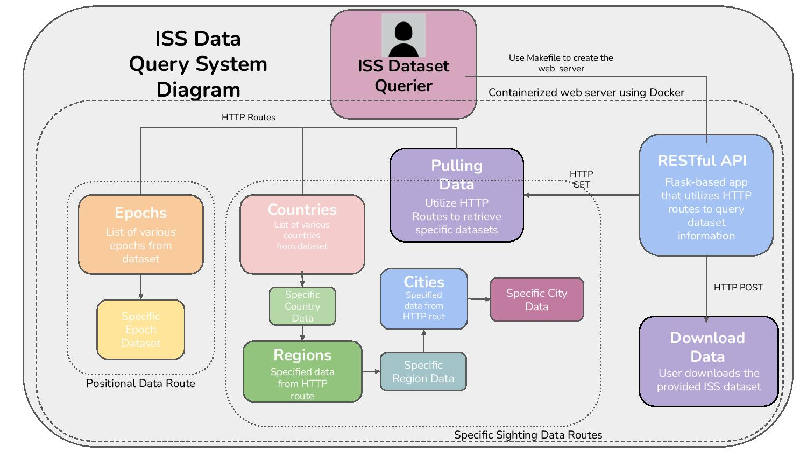

# International Space Station (ISS) Positional and Sighting Data Querier

The ISS Positonal and Sighting Data Querier application provides a user a containerized web application that they can user to query and access specific information ISS sighting and positional data about the spacecraft from the dataset provided by the Johnson Space Center. Those who have even a slight interest in space are able to expand and their develop their love of the ISS by having the containerize accessability to search and specify through large amounts of data such as positon, velocity, and various sightings in their area through this easy-to-use Flask-based web application.

## Understanding the Diagram

The following diagram models the functionality of the ISS P.S Data Querier Project, detailing user actions & interactions to access specific information about the ISS they would like to examine:


First, the user must create a running container of the Flask web server that will host the application. This complicated process was simplified with the ```Make all```  process/command. Utilizing a Makefile, all of the necesary dependencies and variables to run the application environemnt are created. 

Second, the user ```loads``` the dataset, which can be downloaded from a provided link to their respective repository, onto the application with an HTTP  ```-X POST```  action, which by using the ```curl``` method  to the route ```/data```, will allow the user to query the data.

To retrieve any form of data, the user has to use the  HTTP ```GET``` action. In this applciation, two categories of data can be accessed - positional or sighting data, and which is specified through either the ```Epoch```  or ```Countries``` routes respectively. The sectioned off "Positional" or "Epoch" blocks in the diagram are HTTP routes with detailed information with the various return data values one can call when using the application. 

## Project Access

Further details about this project's implementation and how you can use can be found at the hyperlinked [GitHub repository](https://github.com/Costaki33/iss-system/tree/main/iss-system). The includes:
- The ISS Positional and Sighting dataset
- The Docker container of the application
- The commands to run the application
- The routes and the guide of the application
